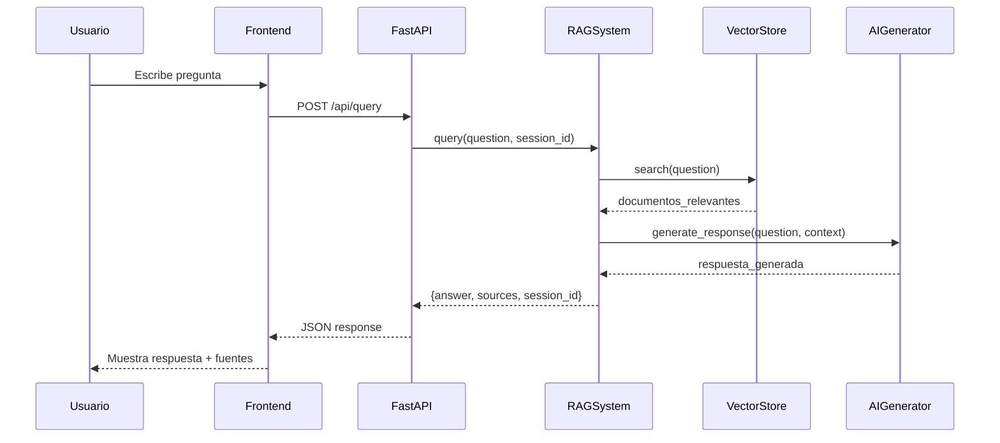
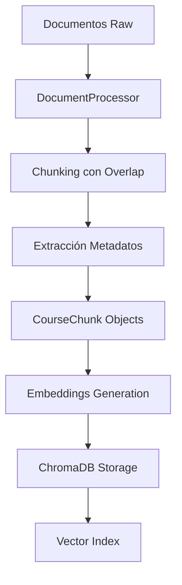

# Documentación Técnica - RAG System

## Arquitectura del Sistema

### Visión General
```
┌─────────────────┐    ┌──────────────────┐    ┌─────────────────┐
│   Frontend      │────│   FastAPI        │────│   RAG System    │
│   (HTML/JS)     │    │   Backend        │    │   (Core Logic)  │
└─────────────────┘    └──────────────────┘    └─────────────────┘
                                │                        │
                                │                        │
                       ┌─────────────────┐    ┌─────────────────┐
                       │   ChromaDB      │    │   AI Provider   │
                       │ (Vector Store)  │    │ (Claude/DeepSeek)│
                       └─────────────────┘    └─────────────────┘
```

### Componentes Principales

#### 1. RAGSystem (rag_system.py)
**Orquestador principal que coordina todos los componentes**

```python
class RAGSystem:
    def __init__(self, config):
        self.document_processor = DocumentProcessor(...)
        self.vector_store = VectorStore(...)
        self.ai_generator = AIGenerator(...)
        self.session_manager = SessionManager()
        self.tool_manager = ToolManager(...)
    
    def query(self, question: str, session_id: str) -> Dict:
        """Flujo principal de consulta RAG"""
        # 1. Buscar documentos relevantes
        # 2. Generar respuesta con contexto  
        # 3. Gestionar historial de sesión
        # 4. Retornar respuesta estructurada
```

#### 2. VectorStore (vector_store.py)
**Gestiona ChromaDB para almacenamiento y búsqueda semántica**

```python
class VectorStore:
    def add_documents(self, chunks: List[CourseChunk]):
        """Añadir documentos procesados al store vectorial"""
        
    def search(self, query: str, n_results: int = 5) -> List[Dict]:
        """Búsqueda semántica con embeddings"""
        
    def get_stats(self) -> Dict:
        """Estadísticas del vector store"""
```

#### 3. DocumentProcessor (document_processor.py)
**Procesa y chunka documentos para indexación**

```python
class DocumentProcessor:
    def process_documents(self, docs_path: str) -> List[CourseChunk]:
        """
        Procesa documentos de cursos:
        1. Lee archivos de texto/markdown
        2. Crea chunks con overlap
        3. Extrae metadatos (título, lección, etc.)
        4. Retorna objetos CourseChunk listos para vectorización
        """
        
    def create_chunks(self, text: str) -> List[str]:
        """Chunking con overlap para mantener contexto"""
```

#### 4. AIGenerator (ai_generator.py)
**Interface unificada para proveedores de IA**

```python
class AIGenerator:
    def __init__(self, provider: str = "anthropic"):
        """Inicializa cliente según proveedor (anthropic/deepseek)"""
        
    def generate_response(self, query: str, context: str, history: List = None) -> str:
        """
        Genera respuesta usando:
        - Query del usuario
        - Contexto de documentos relevantes  
        - Historial de conversación
        """
```

#### 5. SessionManager (session_manager.py)
**Gestiona sesiones de conversación y historial**

```python
class SessionManager:
    def get_or_create_session(self, session_id: str = None) -> str:
        """Obtiene sesión existente o crea nueva"""
        
    def add_message(self, session_id: str, role: str, content: str):
        """Añade mensaje al historial de sesión"""
        
    def get_history(self, session_id: str, limit: int = 2) -> List[Dict]:
        """Obtiene historial reciente para contexto"""
```

## Flujo de Datos

### 1. Consulta de Usuario


### 2. Procesamiento de Documentos


## Modelos de Datos

### CourseChunk (models.py)
```python
@dataclass
class CourseChunk:
    course_title: str          # Título del curso
    lesson_title: str          # Título de la lección
    content: str              # Contenido del chunk
    chunk_index: int          # Índice del chunk en la lección
    course_id: str            # ID único del curso
    lesson_id: str            # ID único de la lección
    metadata: Dict            # Metadatos adicionales
```

### Sesión de Conversación
```python
{
    "session_id": "uuid-string",
    "created_at": "2024-01-01T10:00:00Z",
    "messages": [
        {
            "role": "user",
            "content": "¿Qué es Python?", 
            "timestamp": "2024-01-01T10:00:00Z"
        },
        {
            "role": "assistant",
            "content": "Python es un lenguaje...",
            "sources": ["python-intro.md", "programming-basics.md"],
            "timestamp": "2024-01-01T10:00:05Z"
        }
    ]
}
```

## API Endpoints Detallados

### POST /api/query
**Consultar el sistema RAG**

```http
POST /api/query
Content-Type: application/json

{
    "query": "¿Cómo funciona el machine learning?",
    "session_id": "optional-session-id"
}
```

**Response:**
```json
{
    "answer": "El machine learning es un subcampo de la inteligencia artificial...",
    "sources": [
        "curso-ia/leccion-01-introduccion.md",
        "curso-ia/leccion-03-ml-basics.md"
    ],
    "session_id": "generated-or-provided-session-id"
}
```

### GET /api/courses/stats
**Estadísticas de cursos disponibles**

```http
GET /api/courses/stats
```

**Response:**
```json
{
    "total_courses": 5,
    "total_lessons": 42,
    "total_chunks": 1247,
    "courses": [
        {
            "title": "Introducción a Python",
            "lessons_count": 8,
            "chunks_count": 156
        },
        {
            "title": "Machine Learning Básico", 
            "lessons_count": 12,
            "chunks_count": 289
        }
    ]
}
```

### POST /api/clear/{session_id}
**Limpiar historial de conversación**

```http
POST /api/clear/session-uuid
```

**Response:**
```json
{
    "message": "Session cleared successfully",
    "session_id": "session-uuid"
}
```

## Configuración Detallada

### Variables de Entorno (.env)
```env
# === API Keys ===
ANTHROPIC_API_KEY=sk-ant-api03-xxx
DEEPSEEK_API_KEY=sk-deepseek-xxx

# === AI Provider ===
AI_PROVIDER=deepseek                    # "anthropic" o "deepseek"

# === Embedding Settings ===
EMBEDDING_MODEL=all-MiniLM-L6-v2       # Modelo SentenceTransformers

# === RAG Parameters ===
CHUNK_SIZE=800                          # Tamaño chunks en caracteres
CHUNK_OVERLAP=100                       # Overlap entre chunks
MAX_RESULTS=5                           # Resultados máximos búsqueda
MAX_HISTORY=2                           # Mensajes historial para contexto

# === Storage ===
CHROMA_PATH=./chroma_db                 # Path ChromaDB

# === Server ===
PORT=8000                               # Puerto FastAPI
HOST=0.0.0.0                            # Host binding
```

### Configuración ChromaDB
```python
# Configuración automática en VectorStore
chroma_client = chromadb.PersistentClient(path=chroma_path)
collection = chroma_client.get_or_create_collection(
    name="course_materials",
    embedding_function=embedding_function,
    metadata={"hnsw:space": "cosine"}  # Similaridad coseno para embeddings
)
```

## Prompts del Sistema

### Prompt Principal (RAG)
```python
SYSTEM_PROMPT = """
Eres un asistente especializado en responder preguntas sobre materiales de curso.

CONTEXTO:
{context}

HISTORIAL DE CONVERSACIÓN:
{history}

INSTRUCCIONES:
1. Responde basándote ÚNICAMENTE en el contexto proporcionado
2. Si no encuentras información relevante, di que no sabes
3. Cita las fuentes cuando sea posible
4. Mantén respuestas concisas pero informativas
5. Si hay historial, úsalo para dar contexto pero enfócate en la pregunta actual

PREGUNTA: {query}
"""
```

### Herramientas de Búsqueda Especializadas

#### CourseSearchTool
```python
def search_courses(query: str) -> str:
    """
    Busca información en cursos específicos.
    Útil para preguntas como "¿qué cursos hay sobre Python?"
    """
```

#### CourseOutlineTool  
```python
def get_course_outline(course_title: str) -> str:
    """
    Obtiene estructura/outline de un curso específico.
    Útil para "¿cuál es el contenido del curso de Machine Learning?"
    """
```

## Testing

### Unit Tests
```bash
# Ejecutar tests (cuando se implementen)
uv run pytest tests/

# Tests específicos
uv run pytest tests/test_rag_system.py -v
uv run pytest tests/test_vector_store.py -v
```

### Testing Manual

#### Test API Completo
```bash
# 1. Iniciar servidor
cd backend && uv run uvicorn app:app --reload

# 2. Test query
curl -X POST "http://localhost:8000/api/query" \
     -H "Content-Type: application/json" \
     -d '{"query": "¿Qué es machine learning?"}'

# 3. Test stats
curl "http://localhost:8000/api/courses/stats"

# 4. Test frontend
open http://localhost:8000
```

#### Test Componentes Individuales
```python
# Test directo RAG System
from backend.rag_system import RAGSystem
from backend.config import config

rag = RAGSystem(config)
result = rag.query("¿Qué es Python?")
print(result)
```

## Performance y Optimización

### Métricas Importantes
- **Tiempo de respuesta**: < 3 segundos por query
- **Relevancia de búsqueda**: Precision@5 > 80%
- **Calidad de embeddings**: Similaridad coseno > 0.7 para docs relevantes

### Optimizaciones Implementadas

#### 1. Chunking Inteligente
```python
# Overlap para mantener contexto entre chunks
def create_chunks(text: str, size: int = 800, overlap: int = 100):
    chunks = []
    for i in range(0, len(text), size - overlap):
        chunk = text[i:i + size]
        # Evitar cortar palabras a la mitad
        if i + size < len(text):
            last_space = chunk.rfind(' ')
            if last_space > size * 0.8:  # Solo si no corta demasiado
                chunk = chunk[:last_space]
        chunks.append(chunk)
    return chunks
```

#### 2. Cache de Embeddings
```python
# Cache en memoria para embeddings frecuentes
@lru_cache(maxsize=1000)
def get_query_embedding(query: str) -> List[float]:
    return embedding_model.encode([query])[0].tolist()
```

#### 3. Búsqueda Híbrida
```python
# Combina búsqueda semántica con filtros de metadatos
def hybrid_search(query: str, course_filter: str = None):
    # Búsqueda semántica base
    results = collection.query(query_texts=[query], n_results=10)
    
    # Filtrar por curso si se especifica
    if course_filter:
        results = filter_by_course(results, course_filter)
    
    # Re-ranking por relevancia + recencia
    return rerank_results(results)
```

## Troubleshooting

### Problemas Comunes

#### 1. ChromaDB No Inicializa
```bash
# Síntomas: Error "Collection not found"
# Solución:
rm -rf chroma_db/  # Limpiar DB corrupta
# Reiniciar aplicación para recrear
```

#### 2. Embeddings Lentos
```bash
# Síntomas: Primera query muy lenta (>30s)
# Causa: Descarga inicial del modelo embedding
# Solución: 
uv run python -c "
from sentence_transformers import SentenceTransformer
model = SentenceTransformer('all-MiniLM-L6-v2')
print('Model cached successfully')
"
```

#### 3. API Key Inválida
```bash
# Síntomas: Error 401 en AI generation
# Verificación:
echo $ANTHROPIC_API_KEY  # Debe empezar con sk-ant-
echo $DEEPSEEK_API_KEY   # Debe empezar con sk-

# Test manual:
curl https://api.anthropic.com/v1/messages \
  -H "x-api-key: $ANTHROPIC_API_KEY" \
  -H "anthropic-version: 2023-06-01"
```

#### 4. CORS en Producción
```python
# Si frontend está en diferente dominio
app.add_middleware(
    CORSMiddleware,
    allow_origins=["https://tu-frontend-domain.com"],  # Específico en prod
    allow_credentials=True,
    allow_methods=["GET", "POST"],
    allow_headers=["*"],
)
```

### Logs y Debugging

#### Logging Configurado
```python
import logging

# En cada módulo
logger = logging.getLogger(__name__)

# Logs importantes:
logger.info(f"Processing query: {query[:50]}...")
logger.debug(f"Found {len(results)} relevant chunks")
logger.error(f"AI generation failed: {error}")
```

#### Debug Mode
```bash
# Ejecutar con logs detallados
cd backend
uv run uvicorn app:app --reload --log-level debug

# Ver logs ChromaDB
export CHROMA_LOG_LEVEL=DEBUG
```

## Deployment

### Docker (Recomendado)
```dockerfile
FROM python:3.13-slim

WORKDIR /app
COPY pyproject.toml uv.lock ./

# Install uv and dependencies
RUN pip install uv
RUN uv sync --frozen

COPY . .

EXPOSE 8000
CMD ["uv", "run", "uvicorn", "app:app", "--host", "0.0.0.0", "--port", "8000"]
```

### Variables Producción
```env
# Producción - .env.prod
AI_PROVIDER=anthropic
ANTHROPIC_API_KEY=sk-ant-prod-key
CHROMA_PATH=/data/chroma_db
PORT=8000
HOST=0.0.0.0
```

### Monitoreo
```python
# Métricas básicas para implementar
- Requests por minuto
- Tiempo promedio de respuesta  
- Tasa de error de AI generation
- Uso de memoria ChromaDB
- Sesiones activas
```